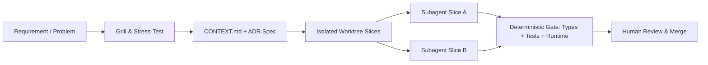

<div align="center">

# Maciek Geneja

**Systems Placement Developer @ Next plc (FTSE 100)** · **BSc (Hons) Computer Science @ Loughborough University (First-Class Honours)**
*Distributed Systems · Deterministic Agentic Engineering · Applied AI & Computer Vision · High-Assurance Full-Stack Architecture*

[](https://maciekgeneja.me)
[](https://x.com/maseeek)
[](https://www.linkedin.com/in/maciek-geneja-552325332/)
[](mailto:maciekgeneja@gmail.com)
[](https://maciekgeneja.me)

</div>

---

## Executive Summary

Systems & Full-Stack Software Engineer combining a rigorous mathematical foundation (**First-Class Honours** across 1st & 2nd Year Computer Science; **86% in Formal Logic**) with industrial placement experience engineering enterprise microservices at **Next plc** and multi-tenant data platforms at **Valdris**.

Focused on **high-throughput backend systems, deterministic multi-agent software engineering (The Software Factory), quantitative & algorithmic modeling, and applied AI/computer vision**.

---

## Systems & Architecture Experience

### 🏛️ Next plc (FTSE 100) — *Systems Placement Developer (PIM Strategic Team)*
> **C# / .NET · Blazor WebAssembly · Distributed Microservices · AI Attribution 2.0 · Enterprise Agentic Enablement**
- Leading UI and client-state re-architecture for **AI Attribution 2.0** using **Blazor WebAssembly** across a multi-repository, multi-solution enterprise microservice ecosystem.
- Engineering high-reliability cross-environment services, automated product classification workflows, and enterprise configuration pipelines within the Product Information & Management (PIM) Strategic Team.
- **Enterprise Agentic Adoption & Developer Onboarding**: Developing internal engineering playbooks and onboarding fellow developers into structured agentic workflows — codifying domain context (`CONTEXT.md`, ADRs), designing deep-module boundaries to contain blast radius, and enforcing deterministic verification gates across multi-repository services.

### 🛡️ Valdris — *Senior Full-Stack Engineer / Technical Architect* · [[Architecture Case Study ↗]](https://maciekgeneja.me/blog/valdris)
> **PostgreSQL Row-Level Security (RLS) · TypeScript · Anthropic Claude SDK · Deterministic Z-Score Engine · Playwright & Vitest**
- Architected a multi-tenant sports science analytics and readiness platform enforcing strict database-level tenant isolation via **PostgreSQL Row-Level Security (RLS)** bound directly to cryptographic JWT claims.
- Engineered **GDPR Article 9** dynamic special-category health data masking and a deterministic **Composite Load Score (CLS)** engine computing 28-day rolling z-scores ($\mu, \sigma$ windowing with cold-start dampening).
- Built an **Anthropic Claude SDK** compliance firewall with deterministic regex pre/post-interceptors to prevent diagnostic medical hallucinations, backed by automated cross-tenant security suites in **Vitest** and **Playwright**.

### 🧠 Outlier AI — *AI Training Contributor (Data Science & Algorithmic QA)*
> **Python · Mathematical Benchmarking · LLM Reasoning Verification · Algorithmic Analysis**
- Authored formal evaluation rubrics and executable Python verification suites to benchmark frontier LLM reasoning across discrete mathematics, data science, and algorithmic edge cases.

---

## ⚡ Agentic Systems Engineering — The Software Factory & Team Enablement
> **Architecture Blueprint & Case Study:** [**Enterprise Agentic Systems: The Software Factory & The Lab (`maciekgeneja.me/blog/enterprise-agentic-systems`) ↗**](https://maciekgeneja.me/blog/enterprise-agentic-systems)

Rather than treating AI coding as ad-hoc prompting, I engineer a **deterministic Software Factory** that allows engineering teams and autonomous agents to ship production software with zero architectural drift:

1. **In-Repo Domain & Context Codification (`CONTEXT.md` · `AGENTS.md` · `ADRs`)**: Translating implicit tribal architecture into version-controlled ubiquitous language and Architectural Decision Records so newly onboarded engineers and autonomous agents reason from identical ground truth.
2. **Deep Modules & Blast-Radius Containment**: Structuring codebases around Ousterhout-style deep modules (narrow, strongly typed contracts hiding complex internals), static dependency boundary rules (`dependency-cruiser`), and isolated git worktrees so concurrent changes never collide or leak across service seams.
3. **Composable Skill Workflows & Spec-Driven Execution**: Standardizing delivery through modular execution loops (*Stress-Test Grilling → Technical Specification → ADR → `ready-for-agent` Vertical Slices → Red-Green-Refactor TDD*) gated by deterministic verification (`npm run check`, Playwright, Vitest).
4. **Team Onboarding & Organizational Leverage**: Upskilling developers to transition from single-turn chat prompts to structured multi-agent orchestration with strict human-in-the-loop architectural sign-off.



### 🖥️ The Lab: Distributed Multi-Computer Compute Setup *(Student Budget · Work in Progress)*

Alongside enterprise repository architecture, I run the Software Factory across **The Lab** — the computers I already own linked over a private **Tailscale** and **SSH** network to run autonomous software development, research, and verification workflows on a placement-student budget before spending paid cloud credits.

#### The Lab — Hardware Nodes
| Node | Hardware Specification | Role & Status |
| :--- | :--- | :--- |
| **Main Windows Workstation** | Intel i5-10400F · **NVIDIA RTX 3060 Ti** · 32GB DDR4 · 500GB SSD + 2TB HDD | **Active** — GPU-intensive workloads, full-stack compilation & target host for lightweight local LLM experiments |
| **Lenovo IdeaPad Pro 5** | **Pop!_OS Linux** · AMD Ryzen 7 7940HS · **NVIDIA RTX 4050** · 16GB RAM | **Active** — Primary portable development environment & remote agent orchestration node |
| **2× HP Pavilion Nodes** | Repurposed legacy x86_64 laptops (scheduled for headless Linux provisioning) | **Planned** — Dedicated persistent agent hosts for 24/7 background tasks, repository maintenance & automation |

#### Current Operational State vs. Planned Architecture
- **Implemented & Active Today**:
  - **Tailscale + SSH Mesh**: Secure cross-network SSH staging between the **Pop!_OS** portable orchestration machine and the **Windows RTX 3060 Ti** workstation.
  - **Software Factory Orchestration**: Active multi-agent execution and experimentation using **Oh My Pi (OMP)** and **T3 Code** with isolated subagent workpools, alongside evaluation of **Hermes Agent**.
- **Planned Features & Experimental Roadmap (In Progress)**:
  - **Hybrid Cost-Aware Model Routing**: Experimenting with intelligent task routing — delegating straightforward tasks to smaller, cheaper, or locally hosted models on the RTX 3060 Ti while escalating complex reasoning and architecture tasks to frontier cloud models across ChatGPT, Gemini, and GitHub Copilot subscriptions.
  - **Persistent Linux Worker Nodes**: Provisioning the two older HP Pavilion laptops as dedicated Linux nodes so autonomous background agents execute without interrupting active development environments.
  - **Unified Cross-Device Orchestrator**: Submitting high-level objectives from any device with automatic delegation across machines, models, and isolated worktrees, documented publicly on [GitHub](https://github.com/Maseeek) and [X (`@maseeek`)](https://x.com/maseeek).

---

## Mathematical & Academic Rigor

**Loughborough University** — *BSc (Hons) Computer Science (2024 – Present)* · **First-Class Honours (Year 1 & Year 2)**

| Core Module | Classification | Technical Domain |
| :--- | :---: | :--- |
| **Logic for Computer Science** | **86%** *(First)* | Propositional & Predicate Calculus, Formal Verification, Discrete Proofs |
| **Mathematics for Computer Science** | **77%** *(First)* | Linear Algebra, Matrix Calculus, Probability & Discrete Structures |
| **Formal Languages & Theory of Computation** | **76%** *(First)* | Automata Theory, Turing Computability, Complexity Classes, Grammars |
| **Computer Graphics** | **76%** *(First)* | 3D Matrix Transformations, Shader Pipelines, Spatial Geometry |
| **Introduction to Algorithms** | **75%** *(First)* | Asymptotic Complexity, Graph Algorithms, Dynamic Programming |
| **Embedded Systems Programming** | **75%** *(First)* | Low-Level C/C++, Deterministic Finite State Machines, UART/Memory Control |

**Hills Road Sixth Form College, Cambridge** — **A-Levels:** Mathematics (**A**), Physics (**A**), Computing (**A**) · **GCSEs:** 7× Grade 9, 2× Grade 8, 2× Grade 7

---

## Flagship Engineering Repositories

| System / Repository | Architecture & Technical Highlights | Stack & Links |
| :--- | :--- | :--- |
| **[nothing-but-net](https://github.com/Maseeek/nothing-but-net)**<br>*(Production Monorepo)* | End-to-end AI basketball shot analytics platform. Features dynamic Region-of-Interest (ROI) tracking, physics-based false-positive rejection, 2nd-degree polynomial trajectory regression ($y = Ax^2 + Bx + C$), Express 5 / Stripe backend, React 19 UI, and a native **Kotlin Android** companion app. | `Python` `OpenCV` `React 19` `Express 5` `Kotlin` `MongoDB`<br>[Live Platform ↗](https://nothingbutnet.online) · [Case Study ↗](https://maciekgeneja.me/blog/nothing-but-net) |
| **[do-it](https://github.com/Maseeek/do-it)**<br>*(Multi-Tenant Habit Engine)* | High-contrast two-player accountability & habit parity platform. Implements isolated duel state via **Supabase RLS**, **AES-256-GCM** encrypted token storage, multi-provider wearable OAuth sync (**Apple Health, Google Health, Strava, Hevy**), scheduled cron workers, and offline-first sync. | `Next.js 16` `TypeScript` `Supabase RLS` `OAuth 2.0` `Tailwind v4`<br>[Live App ↗](https://do-it-plum-seven.vercel.app) · [Case Study ↗](https://maciekgeneja.me/blog/do-it) |
| **[portfolio](https://github.com/Maseeek/portfolio)**<br>*(Engineering Platform & CMS)* | Personal systems portfolio, case study on **Enterprise Agentic Systems**, brand lab, and hybrid Markdown/Store blog CMS. Built with single-owner OAuth 2.0 (GitHub/Google), HMAC-SHA256 session tokens, and ADR documentation. | `Next.js` `TypeScript` `OAuth 2.0` `Tailwind CSS`<br>[maciekgeneja.me ↗](https://maciekgeneja.me) · [Agentic Blueprint ↗](https://maciekgeneja.me/blog/enterprise-agentic-systems) |
| **[Make-It-All-Team-20](https://github.com/Maseeek/Make-It-All-Team-20)**<br>*(Enterprise RBAC Platform)* | Internal enterprise collaboration & workflow system featuring Role-Based Access Control (RBAC), soft-delete audit preservation, MySQL connection pooling, drag-and-drop Kanban state synchronization, and real-time executive telemetry. | `Node.js` `Express` `React` `MySQL` `JWT` `Chart.js`<br>[Case Study ↗](https://maciekgeneja.me/blog/make-it-all) |
| **[LyricForge](https://github.com/Maseeek/LyricForge)**<br>*(Multi-Agent Audio AI)* | 5-stage autonomous audio transformation pipeline built at HackNotts. Coordinates vocal/instrumental stem separation (Spleeter), timestamped ASR transcription (Whisper), syllabic lyric rewriting (Gemini), and neural voice synthesis (ElevenLabs). | `Python` `Gemini API` `ElevenLabs` `Whisper` `Spleeter`<br>[Case Study ↗](https://maciekgeneja.me/blog/lyricforge) |
| **[LED-REMOTE-CONTROL](https://github.com/Maseeek/LED-REMOTE-CONTROL)**<br>*(Async BLE & IoT Sync)* | Asynchronous Bluetooth Low Energy (BLE) GATT hardware controller with background self-healing reconnection workers, real-time Spotify Web API playback synchronization, audio-reactive lighting modes, and SQLite state persistence. | `Python` `Asyncio` `Bleak (BLE)` `Flask` `SQLite`<br>[Case Study ↗](https://maciekgeneja.me/blog/led-remote-control) |

---

## Technical Stack Matrix

```text
Languages & Systems      :: Python (Advanced) · C# / .NET · TypeScript · C/C++ · Kotlin · Java · SQL · PHP
Agentic & Orchestration  :: Oh My Pi (OMP) · T3 Code · Hermes Agent · CONTEXT.md / ADR Systems · Tailscale / SSH (The Lab)
Backend & Architecture   :: Microservices · PostgreSQL (RLS) · Node.js / Express 5 · Flask · REST APIs · OAuth 2.0 / JWT
AI, CV & Quantitative    :: OpenCV · Polynomial Trajectory Modeling · Anthropic Claude SDK · Gemini API · NumPy / Pandas · PyTorch
Frontend & Mobile        :: Blazor WebAssembly · React 19 · Next.js 16 (App Router) · Android SDK (Kotlin) · Tailwind CSS
Infrastructure & Testing :: Docker · GitHub Actions (CI/CD) · Vitest · Playwright · Linux (Pop!_OS) · Supabase · Vercel / Render
```
